# Compact Brush Toggler

A plugin for [Krita](https://krita.org).

## What is Compact Brush Toggler? 

*Compact Brush Toggler* is a Python plugin made for [Krita](https://krita.org) (free professional and open-source painting program). 

This plugin allows one access to "Use Pressure Curve" checkboxes, that toggles pressure on/off specific brush property and "Horizontal Brush Fade" Slider , that controls the horizontal fade/blur of the brush, from a smaller docker without opening the Brush Editor. 

---

## ScreenShots 

*Interface* 
Interface Adjust Depending on the ratio of height and width of the button

| Icon Only | 3 Letter Abbr | Full Length Word |
| --------- | ------------- | ----------- |
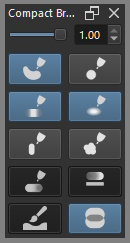 |   | 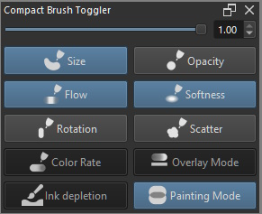 |

 
| Icon On | Icon Off | Abbreviation | Description | 
| ------- | -------- | ------------ | ----------- |
|         |          | Fade         | Brush Fade Slider |
|     | 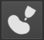  | Sze       | Size Pen Pressure Toggle |
| 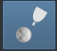     |   | Opc       | Opacity Pen Pressure Toggle |
|      |   | Flw       | Flow Pen Pressure Toggle |
|      |   | Sft       | Softness Pen Pressure Toggle |
|      |   | Rot       | Rotation Pen Pressure Toggle|
|      | 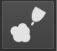  | Sca       | Scatter Pen Pressure Toggle |
| 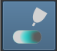     | 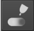  | Col       | Color Rate   |
|      | 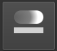 | Ovl       | Overlay Mode - Smudge Brush Engine Only|
|   |  | Sok       | Soak Ink - Bristle Engine Only|
| 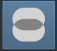| 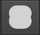 | PtM       | Painting Mode : On -> Wash , Off -> Build |
 
The plugin loads the state of the pressure settings once a brush is selected; 
-- if its highlighted blue then the pressure setting is active
-- if its not highlighted the pressure setting is inactive. 

*Control Toggles and Fade Slider*
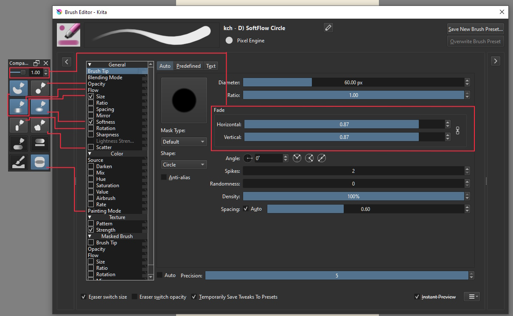

*Paint Mode*
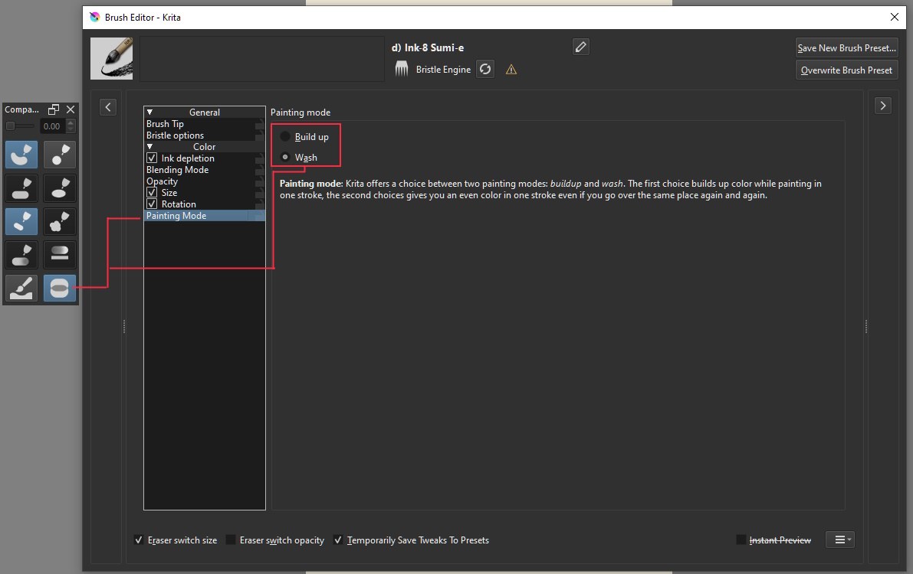

*Overlay Mode for Smudge Brush*
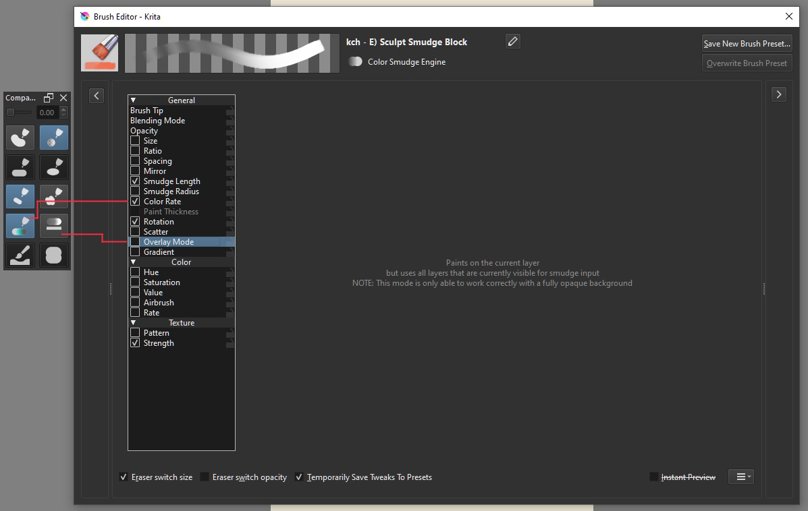

*Soak Ink for Bristle Brush*

 

### Functionalities

This plugin main function  are;

1. Toggle Pen Pressure setting of a particular brush property
> For now the pressure toggle are limited to 7 property namely,
- Size
- Opacity
- Flow
- Softness
- Rotation
- Scatter
- Color Rate
2. Adjust the Horizontal Brush Fade setting of brushes with horizontal brush fade. 
> This would allow adjustment to both fade property if the ratio link is connected. 
3. 3 option Toggle that are not Pen Pressure  
- Overlay
- Soak Ink
- Painting Mode

If the global pressure setting is off, then this plugin pressure setting will also be off. 

[Video Compact Brush Toggler in Action](https://drive.google.com/file/d/1pQa8cNno-4sxo2xajcnBNjxIr7wJ17fM/view?usp=sharing)

### Notes

This plugin access the above properties and setting in the brush editor by traversing Krita's object tree until it sees the brush editor, then again
traversing the brush editor until it found the said property. 

It probably is not effecient and mayhaps be a slow approach but for now its the only way I found to be able to do this.

### Plans --

- Adding a check if the brush editor has been opened and closed, then reload brush state accordingly. 
- Ability to add a pressure toggle to the toolbar
- Bind a pressure toggle to a keyboard shortcut
- Add / remove property to toggle
- A way to change to a skinnier interface or maybe vertical stack layout. 
- Re-write this plugin using better method. 
- Will update this if I feel like I need to add something. 

### Bugs and Known Issues

1. Currently the pressure setting initial states loads only upon selection of a brush. 
If the pressure setting is editted by the Brush Editor this current state wont reflect on the docker. 
You would need to switch to a different brush and back for it to properly reflect. 

2. Sometimes eraser mode is retained upon toggling if you have eraser mode toggled on and off in before the toggle.

3. It wont follow Krita theme if you have different one. [it defaults to blue]

4. Color Rate seems to have issues in other system 

5. It stutters on some system due to polling

6. as of Dec 31, 2022 5.4 nightly is causing problem

## Downloads - Install - Execute 

### Download
- **[ZIP](https://github.com/kaichi1342/CompactBrushToggler/archive/refs/heads/v.0.1.6.zip)**
- **[Source](https://github.com/kaichi1342/CompactBrushToggler)**

### Install

1. Open [Krita](https://krita.org)
2. Got to Tools -> Scripts -> **Import Python Plugins** and select 
**CompactBrushToggler.zip** archive. 
3. Restart [Krita](https://krita.org)
4. Make sure Compact Brush Toggler is enabled in Plugin Manager. 
if not enable it by going to Settings -> Configure Krita -> **Python Plugin Manager** and click to check **Compact Brush Toggler**.
5. Restart Krita.
6. View **Compact Brush Toggler** to your screen by going to Settings -> Dockers -> **Compact Brush Toggler**

### Tested Platforms
- Krita 5.2 
- Krita 5.1
- Krita 5.1.0 Pre-alpha
- Krita 5 beta 5

### Release Log

2024-02-28 : Version 0.1.6 
- Added new icons
- Added shortcuts

2024-02-10 : Version 1.0.0
- Rewritte to use Preset Class
- Added Smudge Length and Mode
- Added new icons
- Added shortcuts

2024-01-13 : Version 0.1.5
- Fix Enabling/Disabling Bug
- Added Support for French, Spanish, Korean Languages
- Added French, Spanish, Korean Translation  

2023-01-05 : Version 0.1.4
- Added Icons and Icon Only Mode
- Remove Fade Label on Fade Slider
- Can now be used for Krita 5.2 and 5.1 

2022-01-04 : Version 0.1.3a
- Re added Color Rate
- Added Soak Ink and Painting Mode

2022-03-11  : Version 0.1.2
- Fix Opacity / Flow Load Status
- Added Overlay Mode for Smudge Brush
- Added disabling of none existing properties
- Re-organize UI 

2021-12-22  : Version 0.1.1b
- First Released Version 
- Added ability to toggle listview checkbox of the brush property
- Added rotation and scatter toggles
- Added a slider control for brush fade
- Re-organized UI 
- Removed brush name label

2021-12-16  : Version 0.1.0 
- First Implemented Version

### Thanks to:
This docker has been possible with the help of AkiR , Grum999, KnowZero 
who provided much of the base code that have helped me develop this.               

## License

### *Compact Brush Toggler* is released under the GNU General Public License (version 3 or any later version).

*Compact Brush Toggler* is free software: you can redistribute it and/or modify 
it under the terms of the GNU General Public License as published by
the Free Software Foundation, either version 3 of the License, or
(at your option) any later version.                               
    
*Compact Brush Toggler* is distributed in the hope that it will be useful,
but WITHOUT ANY WARRANTY; without even the implied warranty of
MERCHANTABILITY or FITNESS FOR A PARTICULAR PURPOSE.
See the GNU General Public License for more details.

You should have received a copy of the GNU General Public License
along with this program. If not, see https://www.gnu.org/licenses/                                   

                            
 
