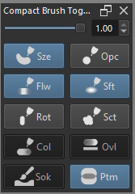

# Compact Brush Toggler

A plugin for [Krita](https://krita.org).

## What is Compact Brush Toggler? 

*Compact Brush Toggler* is a Python plugin made for [Krita](https://krita.org) (free professional and open-source painting program). 

This plugin allows one access to "Use Pressure Curve" checkboxes, that toggles pressure on/off specific brush property and "Horizontal Brush Fade" Slider , that controls the horizontal fade/blur of the brush, from a smaller docker without opening the Brush Editor. 

---

## ScreenShots 

*Interface*

| Abbreviation | Description | 
| --- | --- |
| Br.Fade   | Brush Fade Slider |
| Sze       | Size Pen Pressure Toggle |
| Opc       | Opacity Pen Pressure Toggle |
| Flw       | Flow Pen Pressure Toggle |
| Sft       | Softness Pen Pressure Toggle |
| Rot       | Rotation Pen Pressure Toggle|
| Sca       | Scatter Pen Pressure Toggle |

*Control Toggles*

*Brush Fade Slider*

### Functionalities

This plugin main function is to provide a quick way to toggle individual 
pen pressure setting of brush property without the need to open the brush editor, if the said property is available to the given brush/ or brush engine.

It also provides a way to change horizontal brush fade of brushes that has brush fade. If brush fade is set to be in ratio of each other then both horizontal and vertical brush fade will be change. 

For now the pressure toggle are limited to 6 property namely,
- Size
- Opacity
- Flow
- Softness
- Rotation
- Scatter

If the global pressure setting is off, then this plugin pressure setting will also be off. 

*insert youtube link*

### Notes

This plugin access the above properties and setting in the brush editor by traversing Krita's object tree until it sees the brush editor, then again
traversing the brush editor until it found the said property. 

It probably is not effecient and mayhaps be a slow approach but for now its the only way I found to be able to do this.
  

## Downloads - Install - Execute 

### Download
- 
- **[Source](https://github.com/kaichi1342/CompactBrushToggler)**

### Tested Platforms

## Notes and Releases

### Release Log?

### Suggestion?

### Bugs

### Thanks to:
This docker has been possible with the help of AkiR , Grum999, KnowZero 
who provided much of the base code that have helped me develop this.               

## License

### *Compact Brush Toggler* is released under the GNU General Public License (version 3 or any later version).

*Compact Brush Toggler* is free software: you can redistribute it and/or modify        
it under the terms of the GNU General Public License as published by        
the Free Software Foundation, either version 3 of the License, or           
(at your option) any later version.                                         
    
*Compact Brush Toggler* is distributed in the hope that it will be useful,             
but WITHOUT ANY WARRANTY; without even the implied warranty of              
MERCHANTABILITY or FITNESS FOR A PARTICULAR PURPOSE.                         
See the GNU General Public License for more details.                        

You should have received a copy of the GNU General Public License           
along with this program. If not, see https://www.gnu.org/licenses/                                   

                            
 